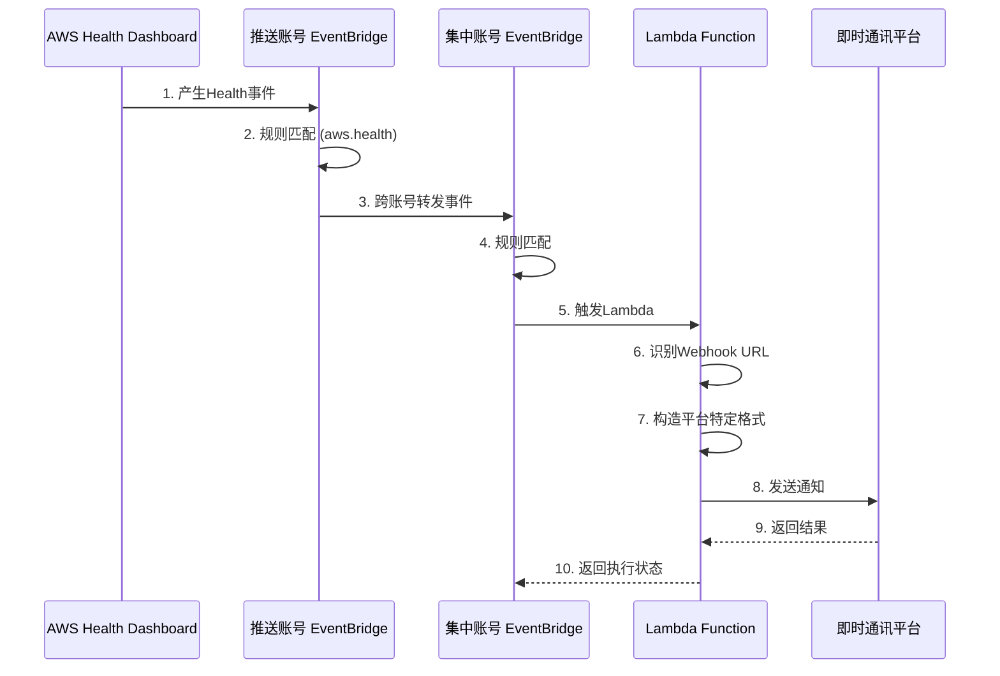

# AWS中国区Personal Health Dashboard集中通知方案 - 架构图

## 架构概览

```mermaid
graph TB
    subgraph "推送账号 1 (Spoke)"
        PHD1[AWS Health<br/>Personal Health Dashboard]
        EB1[EventBridge<br/>Default Bus]
        Rule1[EventBridge Rule<br/>PhDPush]
        PHD1 -->|Health Events| EB1
        EB1 -->|匹配规则| Rule1
    end

    subgraph "推送账号 2 (Spoke)"
        PHD2[AWS Health<br/>Personal Health Dashboard]
        EB2[EventBridge<br/>Default Bus]
        Rule2[EventBridge Rule<br/>PhDPush]
        PHD2 -->|Health Events| EB2
        EB2 -->|匹配规则| Rule2
    end

    subgraph "推送账号 N (Spoke)"
        PHD3[AWS Health<br/>Personal Health Dashboard]
        EB3[EventBridge<br/>Default Bus]
        Rule3[EventBridge Rule<br/>PhDPush]
        PHD3 -->|Health Events| EB3
        EB3 -->|匹配规则| Rule3
    end

    subgraph "集中通知账号 (Hub)"
        CEB[EventBridge<br/>Custom Bus<br/>PhDEventBus]
        CRule[EventBridge Rule<br/>PhDEventRule]
        Lambda[Lambda Function<br/>PhDNotifyLambda]
        Layer[Lambda Layer<br/>requests-python314]
        
        CEB -->|匹配规则| CRule
        CRule -->|触发| Lambda
        Layer -.->|依赖| Lambda
    end

    subgraph "通讯平台"
        Feishu[飞书<br/>Feishu]
        DingTalk[钉钉<br/>DingTalk]
        Teams[Teams]
        WeCom[企业微信<br/>WeCom]
        Slack[Slack]
    end

    Rule1 -->|跨账号转发| CEB
    Rule2 -->|跨账号转发| CEB
    Rule3 -->|跨账号转发| CEB

    Lambda -->|Webhook| Feishu
    Lambda -->|Webhook| DingTalk
    Lambda -->|Webhook| Teams
    Lambda -->|Webhook| WeCom
    Lambda -->|Webhook| Slack

    style PHD1 fill:#FF9900
    style PHD2 fill:#FF9900
    style PHD3 fill:#FF9900
    style CEB fill:#FF6B6B
    style Lambda fill:#4CAF50
    style Layer fill:#2196F3
    style Feishu fill:#00D6B9
    style DingTalk fill:#0089FF
    style Teams fill:#5B5FC7
    style WeCom fill:#07C160
    style Slack fill:#4A154B
```

## 事件流程

## 组件说明

### 推送账号 (Spoke)
- **AWS Health Dashboard**: 产生PHD事件
- **EventBridge Default Bus**: 接收AWS服务事件
- **EventBridge Rule**: 匹配Health事件并转发到集中账号

### 集中通知账号 (Hub)
- **EventBridge Custom Bus**: 接收来自多个推送账号的事件
- **EventBridge Rule**: 匹配事件并触发Lambda
- **Lambda Function**: 处理事件并发送通知
- **Lambda Layer**: 提供requests库依赖

### 通讯平台
支持5个主流即时通讯平台，通过Webhook URL自动识别目标平台

## 关键特性

1. **Hub-Spoke架构**: 集中管理，便于维护
2. **自动识别**: 根据Webhook URL自动识别通讯平台
3. **跨账号支持**: 支持同账号、跨账号、跨组织部署
4. **低成本**: 基本在AWS免费额度内
5. **高可用**: 无服务器架构，自动扩展
